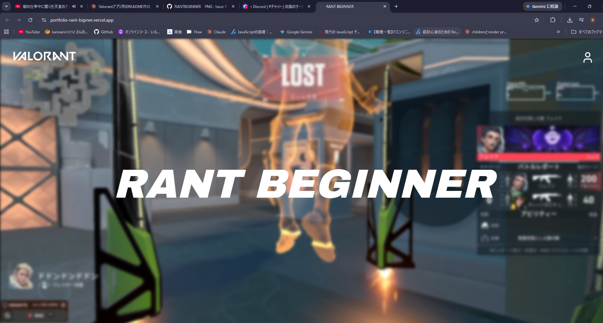
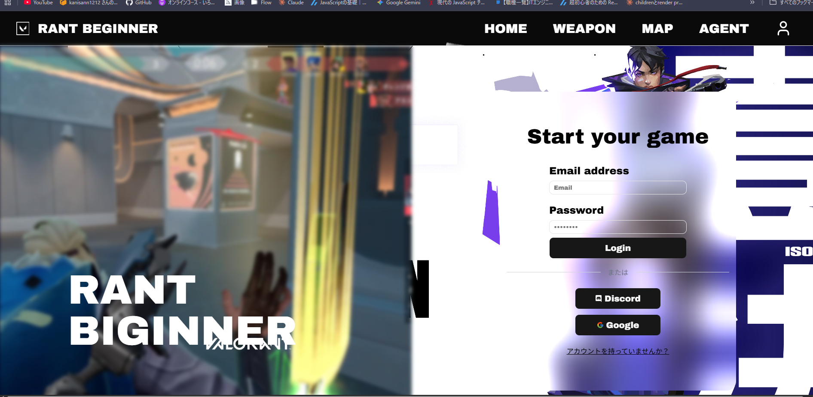
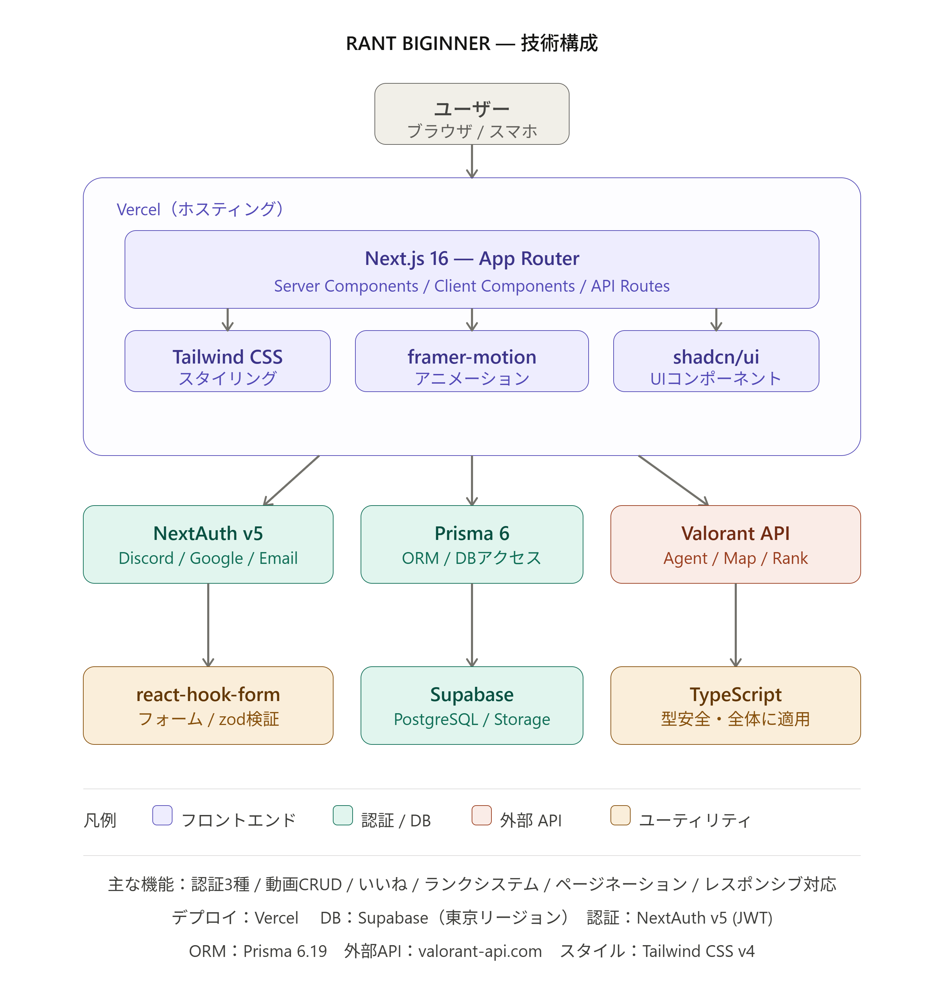

# 🎯 [RANT BIGINNER] 

> Valorantの初心者から玄人まで誰もが自分のクリップを共有・管理するためのプラットフォーム 

**🔗 Live Demo:** [https://portfolio-rant-biginer.vercel.app/]
**🔗 Demo 
           

---

## 📌 このアプリを作った理由

<!-- ✏️ CUSTOMIZE: ここが一番大事。面接でも絶対聞かれるので自分の言葉で書く -->
> Valorantを初心者に教える気かがあった時に、ちりばめられた知識や技術が一括されたサイトがあったら便利だなと思った。またやってて、「あのキルシーン残しておきたいな」とか「このエイムどうやったっけ」って思ったことが何度もあった。  
> YouTubeなどに挙げたお気に入りクリップを仲間内で簡単に共有でき、それをvalorantをやっているプレイヤーにも簡単に共有できる、またその動画を上げることがモチベーションになる機能を持ったサービスがあればと思った。  
> そういう「プレイヤーが自分のクリップを自分のために管理できる場所」が欲しくて作った。

---

## 🛠 Tech Stack

| カテゴリ | 使用技術 |
|------|------|
| **Frontend** | Next.js 14 (App Router) / TypeScript | React 
| **Styling** | Tailwind CSS / shadcn/ui | Lucide React 
| **Animation** | Framer Motion | 
| **認証** | NextAuth.js v5 (Google / Discord / Credentials) |
| **DB** | Prisma / Supabase (PostgreSQL) |
| **Storage** | Supabase Storage |
| **Deploy** | Vercel |
| **外部API** | [Valorant API](https://valorant-api.com/) |

---

## ✨ 主な機能

### 動画アップロード & 管理
- エージェント・マップ・タイトルと紐づけて動画を投稿
- 自分の投稿一覧をマイページで管理
- 動画の削除機能（本人のみ）
- ほかのユーザーがアップした動画の閲覧やいいね機能
- いいねした動画の優先表示

### ゲームデータとの連携
- Valorant APIからエージェント・マップ情報をリアルタイム取得
- エージェントのフルポートレートやマップスプラッシュを表示
- 投稿数に応じたランクシステムで表示内容が変化

### 認証
- Google / Discord でのソーシャルログイン
- メール＋パスワードのCredentials認証
- 未ログイン状態でのアクセス制御

### UI / UX
- Framer Motionによるスクロールアニメーション・ホバーエフェクト
- ログイン状態・投稿数による条件分岐表示
- レスポンシブ対応 (PC / スマホ)

---

## 🏗 システム構成



---

## 🤔 設計上の判断

### なぜ Supabase Auth を使わず NextAuth にしたか
Supabase には Auth 機能があるが、今回は **Supabase をDB(PostgreSQL)とストレージの実体として使い、認証ロジックは NextAuth に集約する** という役割分担を意図的に選んだ。  
理由は Google / Discord / Credentials の複数プロバイダを一元管理したかったことと、JWT strategy でセッション管理を柔軟にカスタマイズ（`favoriteAgent` などの追加フィールド）したかったため。

### App Router (RSC) とクライアントコンポーネントの分離
データ取得はサーバーコンポーネントで完結させ、アニメーションや状態管理が必要な部分のみクライアントコンポーネントに切り出した。  
`auth` のような Node.js 依存の処理をクライアントバンドルに混入させないよう、`getIconHeader` などのユーティリティはサーバー専用に設計。


---

## 📁 ディレクトリ構成（主要部分）

```
src/
├── app/
│   ├── (auth)/          # ログイン / サインアップ
│   ├── mypage/
│   │   └── [Vinfo]/     # 動画詳細ページ
│   └── api/
│       └── video/[Vinfo]/ # DELETE API
├── components/
│   ├── ui/              # shadcn/ui ベースのUIパーツ
│   └── animation/       # Framer Motionコンポーネント
├── lib/
│   ├── prisma.ts
│   ├── InfoAgent.ts     # Valorant API ユーティリティ
│   └── Infomap.ts
└── types/
    └── type.ts          # 型定義
```

---

## 🚀 ローカルで動かす

```bash
git clone https://github.com/kanisann1212/portfolio-RANT-BIGINER-.git  
cd portfolio-RANT-BIGINER-
npm install
```

`.env.local` を作成：

```env
DATABASE_URL=
DIRECT_URL=
NEXTAUTH_SECRET=
NEXTAUTH_URL=http://localhost:3000
AUTH_GOOGLE_ID=
AUTH_GOOGLE_SECRET=
AUTH_DISCORD_ID=
AUTH_DISCORD_SECRET=
NEXT_PUBLIC_SUPABASE_URL=
NEXT_PUBLIC_SUPABASE_ANON_KEY=
```

```bash
npx prisma migrate dev
npm run dev
```

---

## 📈 今後やりたいこと 

- [ ] いいね・コメント機能
- [ ] 動画タグ検索 / フィルタリング
- [ ] プロフィール編集ページ


---

## 👤 作者


- GitHub: [@kanisann1212](https://github.com/kanisann1212)


---

> 一年半、汗と涙を流して積み上げた集大成です。💪
